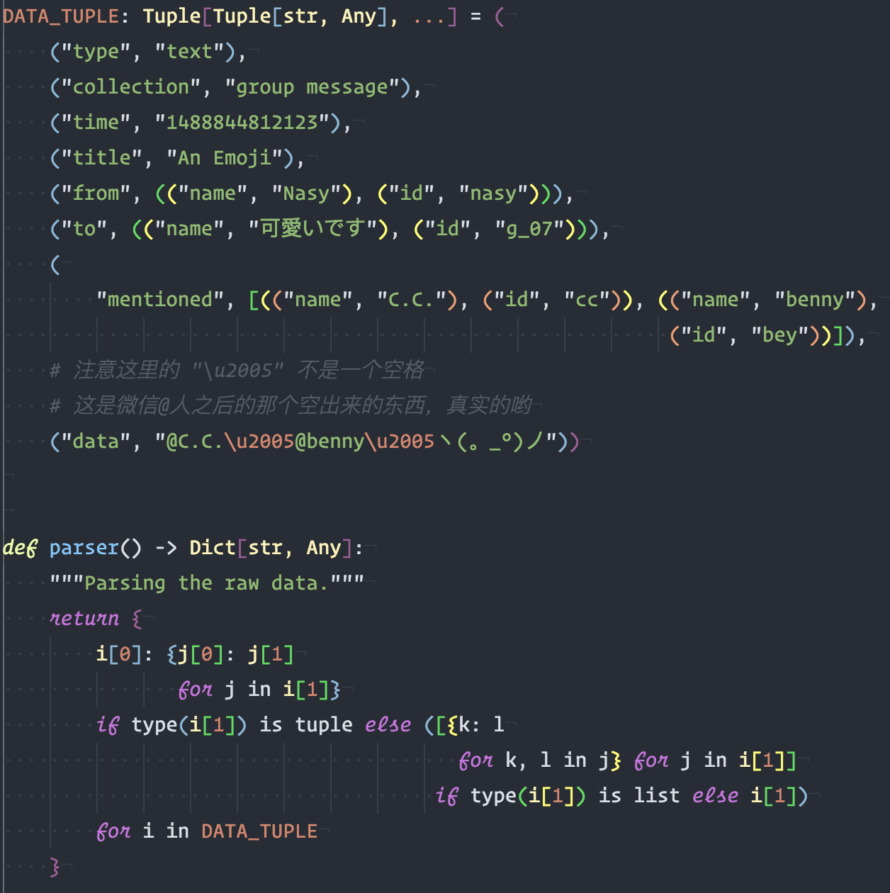
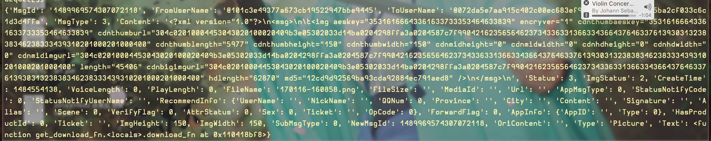
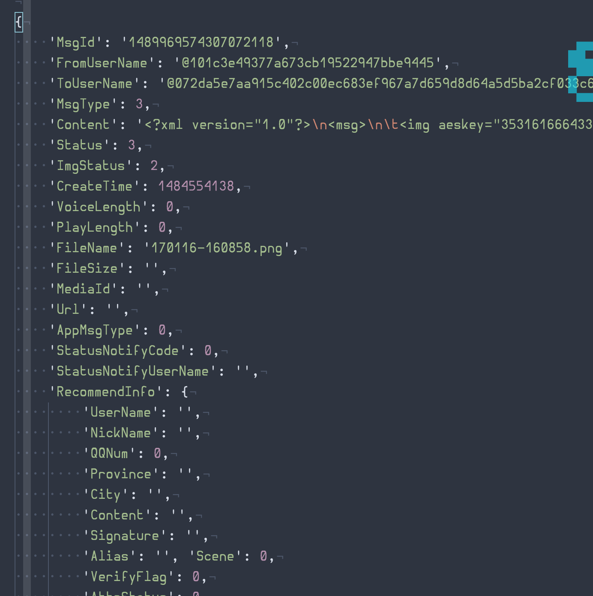

# 开始之前的吐槽

这期的内容稍微有点长，请耐心看下去，部分内容可能网络上的很多教程里面都不会涉及，具体是哪些呢，自己看吧。

这么长时间过去了，今天才更新，真是抱歉。。。啊，不过仔细思考了下，或许我可以留个题目啊什么的。

这一次结束过后，主要内容就结束了，错误处理虽然也很基本，但是估计get不到使用的时候，不是很像写。接下来的主要就是一些小 tips，一些常用的包的简介，更新频率也不会固定吧。

Python 作为一种脚本语言，既能面向对象又能函数式编程，而且超简单，比 Matlab 简单多了，更不用说，钱也不用花，一个星期，或许两个星期前，说起函数式语言来，其中，有一本书说 R 语言是一种函数式语言，在我看来，R 和 Python 一样，只是能进行一些函数式编程。在本次的内容中，特别的不进行任何的存储，使用函数式编程写了一些。

之前写了很长时间的 lisp，也一起了解了很多 Haskell。Haskell 是纯粹的FP（函数式编程语言），lisp都还有一些 side effect 在里面。或许只有真正的两种类型的语言都写过，都使用过，才能很好的对比一下 OOP 与 FP。入了纯粹的 FP 坑之后，越来越觉得函数式编程才是最让人感到舒服的。昨天又看了篇 John M. Chambers (S 语言的创始人) 的文章，[Object-Oriented Programming, Functional Programming and R \[PDF\]](https://arxiv.org/pdf/1409.3531.pdf)，其中提到了这样的几点:

> the main principles of functional programming can be summarized as follows:
>
> 1.  Programming consists largely of defining functions.
> 2.  A function definition in the language, like a function in mathematics, implies that a function call returns a unique value corresponding to each valid set of arguments, but only dependent on these arguments.
> 3.  A function call has no side effects that could alter other computations.

除了 Haskell，初代的 lisp，再也没有什么能够做到了第三点了。R 和 Python 虽然能够在不使用 side effect 的情况下，编写出想要的东西，但基本没人这么做。Python 不用说了，目的就是人人都能使用的编程语言。而 R 呢？目前的很多新加入的包，大量使用了 OOP (John M. Chambers) 的类型，方法。

FP 很让人入迷，编写出的东西给人一种说不出的感觉，很爽的一种。另外最近在学习着 Scala，不知道有没有兴趣一起来的？很多人也是在提到 Scala 的 FP 部分如何如何强大，不过 Scala，真正走的远的，是在 OOP 部分。

或许，以后我写的 Python，也会大量的使用这种方式吧！啊，当然是在效率不低，可以接受的情况下。

## 开始

在之前的准备中，我们都是在交互模式下使用的 `Python`，从现在开始，我们将不止在交互模式下继续 `Python`，还要写完整的 `py` 文件。

Python 的一切都是要符合 [PEP](https://www.python.org/dev/peps/) 规范的。那么真正的编程开始了。

### 条件语句 和 条件表达式

啊，这个没多少好说的。Python 中的条件语句结构是 `if-elif-else` ，把原来C语言中的 `else if 改为 elif` 嗯，写起来更简单了。而条件表达式，则对应着 C语言中的 `a?b:c` 。就这样吧：

```python
# 每个完整的条件语句之后应该空一行
# 完整的情况
if condition_1:
    print("condition_1 is True")
elif condition_2:
    print("condition_2 is True")
else:
    print("...")    

# 不存在 else 的情况
# 通常每个语句应该独占一行
if condition:
    print("ヽ(。_°)ノ")

# 只有不存在 else，以及只执行一个动作的时候，允许下面这样写。
if condition: print("ヽ(。_°)ノ")

# a?b:c 结构的条件表达式
b if a else c
```

### 循环语句

Python 的循环，非常简单方便，除了常见的 `while, for` 都能使用外，还有一些语法糖。

-   每个完整的循环语句之后应该空一行。
-   跳出循环使用 `break`，继续循环使用 `continue`，以及占位用的 `pass`
-   循环 `list` 直接使用 `for i in list`，循环 `dict` 使用 `for key, value in dict.items()`
-   如果需要知道循环的 `index`，使用 `for index, ele in enumerate(Object)`。注意，从 0 开始计算index

```python
"""循环语句."""
# while ... else ... 循环。else 在 while 那里为 False 的时候执行
# 需要无限循环的时候，使用 while 1: 就行
# while 1 所需要的时间比 while True 要短。
i = 0
while i < 5:
    print(i)
    i += i
else:
    print(i + 1)    

# 运行结果:
# 0
# 1
# 2
# 3
# 4
# 6

# for ... else ... 循环
# 这是使用的最多的循环了。
# 循环5次，不输出第二次的结果，并在第4次的时候停止
for i in range(5):  # range(5) 得到的是 (0, 1, 2, 3, 4)
    if i == 1:
        continue
     elif i == 3:
        break

    print(i)
else:
    pass

# 运行结果
# 0
# 2

# 循环 list 与 dict
for i in [1, 2, 3, 4]:
    print(i)

for key, value in {1:2, 2:3, 3:4}.items():
    print(key, value)

# 结果
# 1
# 2
# 3
# 4
# 1 2
# 2 3
# 3 4

# 循环 dict 并记录 index
for i, e in enumerate({1:1, 2:2, 3:3}.items()):
    print(i, e)

# 结果
# 0 (1, 1)
# 1 (2, 2)
# 2 (3, 3)
```

### 函数

#### 函数构造

函数是 Python 中使用的最多的东西了。Python 有两种构造一个函数的方法，一种大多数情况下使用的 `def function_name(parameters)`，一种是 lambda 创建的匿名函数 `lambda args: expression` 。大部分情况下都用前一种，后一种主要用于一些突然要写点小函数的地方，比如把 `dict` 当作 `switch ... case ...` 使用的时候。

Python 不需要 `main()` 函数也能运行。函数名使用小写字母加下划线的结构，别用驼峰式。

代码示例

```python
# 声明 def
def fibonacci(x: int) -> None:  # 这里使用的 ": int" 以及 " -> None"  并不是必须的
    """Fibonacci series up to x."""  # 但使用的话可以让函数的运行速度更快
    a, b = 0, 1
    while a < x:
        print(b, end=" ")
        a, b = b, a + b  # python 中，交换两个数只需要 a, b = b, a 非常方便
    return a

# 使用
result = fibonacci(1000)
# 结果
# 1 1 2 3 5 8 13 21 34 55 89 144 233 377 610 987
# >>> result
# 987

# 声明 lambda
# 注意，这种写法是非常不推荐的，虽然没什么错误，但这种情况应该使用 def 而非 lambda
rectangle_area = lambda a, b: a * b
# def 版本
# def rectangle_area(a, b):
#     """Rectangle area."""
#     return a * b

# 使用
area = rectangle_area(10, 5)
# 结果
# >>> area
# 50

# 正常使用 lambda 的情况之一
def rectangle_area(wide):
    """rectangle_area"""
    return lambda long: wide * long

# 使用
rect = rectangle_area(10)  # 一个宽为10的矩形
rect(10)  # 宽为10的情况下，长为10
rect(7)  # 宽为10的情况下，长为7

# 上面两个的返回值为 100 和 70

# 其他使用 lambda 的情况：数值计算，列表推导以及关键词排序。
```

#### 函数参数

构造一个函数的时候，如果要一个参数或者两个参数的时候，只需要直接 `def func_name(p1, p2)` ，使用的时候，`func_name(p1, p2)` 或者 `func_name(p2=xx, p1=xxx)` 就行。前一种方式只需要按照 `p1, p2` 的顺序，填上参数就行，后一种，可以不按照顺序，使用参数的关键词。

有些时候我们需要的参数可能不止一个，比如要100个之类的，这时候显然不能 `p1, p2, ...` 这样写下去了。Python 可以构造一个可接受任意数量参数的函数。

为了让一个函数接受任意数量的参数，使用 `*`，例如：

```python
def avg(first, *args):
    """Average."""
    return (first + sum(args)) / (len(args) + 1)

# 使用结果
# >>> avg(1,2,3,4,5)
# 3.0
```

`args` 在函数里把它当作一个列表来使用就好。这只是可以接受任意数量的普通参数，如果使用 `**`，那就可以构造任意数量关键词参数的函数：

```python
def disp_info(**kwgs):
    """Display name and age."""
    for name, age in kwgs.items():
        print(name, age)

# 使用结果
# >>> disp_info(Tom=19, Benny=21, Summer=2, Sue=33, Mewing=32)
# Tom 19
# Benny 21
# Summer 2
# Sue 33
# Mewing 32
```

那么新问题来了，如果本来有一个 `list`，一个 `dict`，在遇到这种函数的时候，还要把它分解为一个一个的，非常麻烦。不过简单的方法也有，使用 `*` 和 `**` 就行，这也是 Python 的语法糖吧！

```python
lst = [1, 2, 3, 4, 5]
info = {'Tom': 19, 'Benny': 21, 'Summer': 2, 'Sue': 33, 'Mewing': 32}
# 使用方法
# 正确
avg(*lst)
disp_info(**info)


# 会报错，不信可以试试
avg(lst)
disp_info(info)
```

#### 函数递归

先来看看，如果要实现一个 `sum(List)` 的函数，应该怎么写：

```python
def sum(lst):
     """Sum."""
     result = 0
     for i in lst:
          result += i
     return result
```

注意这个函数，内部引入了一个新的变量，`result`，这一点也不函数，函数就应该专门计算。于是有了下面这种函数式的写法：

```python
def sum(lst):
     """Sum."""
     if len(lst):
        return lst[0] + sum(lst[1:])
     else:
        return 0
```

啊，如果之前没有接触过函数式编程的话，这种方式是不是有种很奇怪的感觉？不过要是写过 `lisp` 的话，一定对这种方式很熟悉。这种方式虽然写起来很爽，但也有一个问题，比较占内存，当你超过一千次的时候，就会出现下面这个错误了。

```python
RecursionError: maximum recursion depth exceeded
```

避免出现这个错误只需要加上这样的两行:

```python
import sys
sys.setrecursionlimit(5000)  # 想要多少写多少，默认是1000
```

### 推导式

使用列表的时候，应该会出现一个问题，如何创建一个全是1或者全是0啊之类的 `list`，数量小的时候还好说，直接：

```python
>>> lst = [1, 1, 1, 1, 1]
>>> lst2 = [0, 0, 0, 0, 0]
```

要是遇到需要创建的是100个1，1000个0的 `list` 的时候怎么办？这时候就需要用到推导式了。

最简单的推导式，使用 `* count.`

```python
>>> [0] * 1000
[0, 0, ..., 0]  # 共 1000 个 0

# 生成一个 3x3 的单位矩阵
>>> [[1] * 3] * 3
[[1, 1, 1],
 [1, 1, 1],
 [1, 1, 1]]
```

稍微复杂一些的，从一个 `list/tuple, dict` 中取得需要的值：

```python
# list/tuple
# 注意!! 这种做法得不到 tuple，也就是说，不能是 (i for i in [1, 2, 3, 4]) 这样的
[i for i in [1, 2, 3, 4]]  # 得到 [1, 2, 3, 4]
[i for i in (1, 2, 3, 4)]  # 得到 [1, 2, 3, 4]

# dict
{k: v for k, v in {"a": 1, "b": 2, "c": 3}}  # 得到 {"a": 1, "b": 2, "c": 3}
```

可能看上去似乎没什么用，因为上面这样的，使用 `list.copy() dict.copy()` 也能办到。事实上，这个推导式能做到的更多：

```python
# 将 list 里的偶数都 *3，奇数不变
lst = [1, 2, 3, 4, 5, 6, 7]
# 想要的结果 [1, 6, 3, 12, 5, 18, 7]
result = [i * 3 if i % 2 == 0 else i for i in lst]
print(result)  # 可以看看是不是这样的

# 还可以更复杂一些
# 将 list 里面能被 2 整除的提出来，如果还能被 4 整除，那就乘以 3
lst = [1, 2, 3, 4, 5, 6, 7]
# 想要的结果 [2, 12, 6]
result = [i * 3 if i % 4 == 0 else i for i in lst if i % 2 == 0]
print(result)
```

或许，这样子的，使用一个循环也能办到，但是，如果我想要得到的一个结构很复杂的时候，推导式能做到的，就不是一个循环，两个循环可以搞定的了。比如说从什么诡异的地方得到了一个巨大的 `tuple`，为了以后读取啊，操作啊，更快速，更方便，要把它转为 `dict` 的形式。比如下面的这个，虚拟的，已经解析过一次的微信消息，需要解析成 `dict` 的形式：（可以先不看后面我的做法，自己试试看）

```python
from types import Tuple, List, Dict, Any

# 不要问我为什么这么多括号怎么对齐，怎么不看花的，你们要知道，lisp 比这个不知道高到哪里去了，我和 lisp 啊，谈笑风生

DATA_TUPLE: Tuple[Tuple[str, Any], ...] = (
    ("type", "text"),
    ("collection", "group message"),
    ("time", "1488844812123"),
    ("title", "An Emoji"),
    ("from", (("name", "Nasy"), ("id", "nasy"))),
    ("to", (("name", "可愛いです"), ("id", "g_07"))),
    (
        "mentioned", [(("name", "C.C."), ("id", "畅酱")), (("name", "benny"),
                                                         ("id", "bey"))]),
    # 注意这里的 "\u2005" 不是一个空格
    # 这是微信@人之后的那个空出来的东西，真实的哟
    ("data", "@C.C.\u2005@benny\u2005ヽ(。_°)ノ"))
```

初一看，似乎很复杂。不过这也是已经解析过一遍，而且简化过的了，原始的数据，就一段 `xml (或者希望是 json (如果是json那就幸福很多了！))` 甚至就一段字符串，中间靠 `\t` 之类的分隔符分割。

来看看我怎么处理吧：

```python
def parser() -> Dict[str, Any]:
    """Parsing the raw data."""
    return {
        i[0]: {j[0]: j[1]
               for j in i[1]}
        if type(i[1]) is tuple else ([{k: l
                                       for k, l in j} for j in i[1]]
                                     if type(i[1]) is list else i[1])
        for i in DATA_TUPLE
    }

# 使用

data = parser()
print(data)
# {'type': 'text', 'collection': 'group message', 'time': '1488844812123', 'title': 'An Emoji', 'from': {'name': 'Nasy', 'id': 'nasy'}, 'to': {'name': '可愛いです', 'id': 'g_07'}, 'mentioned': [{'name': 'C.C.', 'id': '畅酱'}, {'name': 'benny', 'id': 'bey'}], 'data': '@C.C.\u2005@benny\u2005ヽ(。_°)ノ'}
# 啊，看的不太清晰
import pprint  # pprint 这个包，可以让你打印到屏幕上的 list, dict 之类的更漂亮
pprint.pprint(data)
# 结果，达到目的
# {'collection': 'group message',
#  'data': '@C.C.\u2005@benny\u2005ヽ(。_°)ノ',
#  'from': {'id': 'nasy', 'name': 'Nasy'},
#  'mentioned': [{'id': '畅酱', 'name': 'C.C.'}, {'id': 'bey', 'name': 'benny'}],
#  'time': '1488844812123',
#  'title': 'An Emoji',
#  'to': {'id': 'g_07', 'name': '可愛いです'},
#  'type': 'text'}

# 输出成人能看的
for i in data.items():
    print(*i, sep=': ')
# 结果
# type: text
# collection: group message
# time: 1488844812123
# title: An Emoji
# from: {'name': 'Nasy', 'id': 'nasy'}
# to: {'name': '可愛いです', 'id': 'g_07'}
# mentioned: [{'name': 'C.C.', 'id': '畅酱'}, {'name': 'benny', 'id': 'bey'}]
# data: @C.C. @benny ヽ(。_°)ノ
```

### Python 文件

C语言的源代码文件是 `*.c, *.h`，编译后的文件， `*.exe (windows), * (other), *.so (share lib)`。`Python` 不用编译，主要的源代码文件是 `*.py` 以及特别强调是 `Python3` 的 `*.py3` 文件。还有一些 `*.cpy` 之类的，则不用太在意了。根据 PEP-394 `py` 文件里，应该以 `Shebang ( Hashbang )`开始。

一般来说，一个 `py` 至少是这样的:

-   第一行写 `Shebang`，就是 `#!/usr/bin/env python3`
-   第二行写文件的格式
-   接下来在 `""""""` 之间写这个文件的文档，可以不像我这样写的这么全，最好留下作者以及邮箱。避免出错的时候不知道找谁啊什么的
-   最后就开始写代码了

在代码中，和其他语言一样，有一个 `main` 函数，大多数情况下，我们就是运行这个。虽然在 `python` 中这不是强制的，但这样写可以避免发生很诡异的一些事情。最后那个 `__name__ == "__main__"` 就是说是，这段程序是直接运行的，不是由其他文件引用而运行的，注意，这个非常重要，主功能应该放在 `main()` 函数中。

在文件的结尾，应该留出一行空行。

将前面推导式中解析一个巨大的 `tuple` 那一部分写成一个 `temp.py` 如下：

```python
#!/usr/bin/env python3
# -*- coding: utf-8 -*-
"""
Life's pathetic, let's happy coding everyday ♡~ Nasy.

@author: Nasy
@date: Mar 11, 2017
@email: sy_n@me.com
@file: temp.py
@license: MIT

Copyright © 2017 by Nasy. All Rights Reserved.
"""
from typing import Tuple, List, Dict, Any
import pprint

DATA_TUPLE: Tuple[Tuple[str, Any], ...] = (
    ("type", "text"),
    ("collection", "group message"),
    ("time", "1488844812123"),
    ("title", "An Emoji"),
    ("from", (("name", "Nasy"), ("id", "nasy"))),
    ("to", (("name", "可愛いです"), ("id", "g_07"))),
    (
        "mentioned", [(("name", "C.C."), ("id", "畅酱")), (("name", "benny"),
                                                         ("id", "bey"))]),
    # 注意这里的 "\u2005" 不是一个空格
    # 这是微信@人之后的那个空出来的东西，真实的哟
    ("data", "@C.C.\u2005@benny\u2005ヽ(。_°)ノ"))


def parser() -> Dict[str, Any]:
    """Parsing the raw data."""
    return {
        i[0]: {j[0]: j[1]
               for j in i[1]}
        if type(i[1]) is tuple else ([{k: l
                                       for k, l in j} for j in i[1]]
                                     if type(i[1]) is list else i[1])
        for i in DATA_TUPLE
    }


def main() -> None:
    """Main function."""
    data = parser()
    pprint.pprint(data)
    print()
    for i in data.items():
        print(*i, sep=': ')


if __name__ == "__main__":
    main()
```

## 一些附件

### 一个小题目

把这一段 `Tuple`，使用 `for 循环` 与 推导式结合的方式写出来（或许这才是最优方案）

### 括号的秘密



### 一段真实解析后的微信聊天记录的 `dict`




